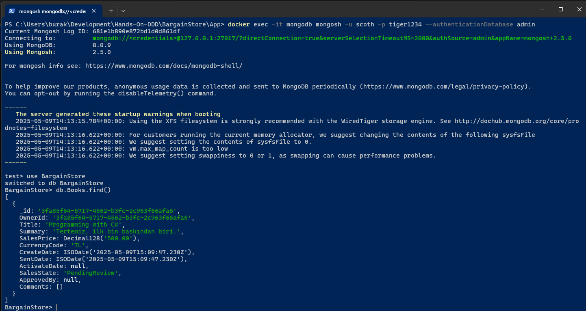

# Hands-On-DDD

C# ile basit bir Domain Driven Design macerası. Senaryoda ikinci el kitaplara ait ilanların verildiği bir platform söz konusu. Referans kaynak olarak Alexey Zimarev'in 2019 yılında Packt yayınlarından çıkan Hands-On Domain Driven Design with .NET Core kitabı baz alınmıştır. C# ve .Net'in güncel bazı özellikleri de işin içerisine katılmaya çalışılmıştır. Orjinal kitap RavenDb ve Postgresql tabanlı yaklaşımları ele alır ama ya EF ya RavenDb ile ilerlenir. Ben domain bazında bazı context içeriklerini farklı şekillerde ele almak istedim. Örneğin ikinci el kitap satışı ile ilgili olanları MongoDb üzerinde doküman formatında yönetmek, üyelik işlemleri içinse Postgresl kullanmak istedim. Bu yer yer zorluklara sebep oldu. Sistemdeki tüm bileşenler, ihtiyaç duyduğu tüm diğer bileşenleri DI Container üzerinden aldığından tek IUnitOfWork implementasyonları işe yaramayacaktı. Dolayısıyla MongoDb ve Postgresql için hem repository hem unit of work bileşenleri ayrı interface türleri üzerinden yönetilmekte. Bu DDD tasarımına aykırı görünmüyor.

## Veritabanı

Bu çalışmada ikinci el kitap satış tarafı için Mongodb veritabanı tercih edilmiştir.

```bash
docker compose up -d
```

Örnek bir swagger testini takiben MongoDb terminaline bağlanarak verinin oluşup oluşmadığı kontrol edilebilir.

```bash
docker exec -it mongodb mongosh -u scoth -p tiger1234 --authenticationDatabase admin

use BargainStore
db.Books.find()
```



Senaryoyu farklılaştırmak adınma membership management kısmında Postgresql kullanımı tercih edilmiştir. Hem MongoDb hem Postgresql servisleri docker compose aracılığı ile ayağa kaldırılır.

## Testler

BookNotice Api tarafı için örnek curl komutları _(Pek tabii proje başlatıldığında açılan Swagger arabirimi üzerinden de ilerlenebilir)_

İkinci ek bir kitap satışı için kayıt açarkan aşağıdaki örnek curl komutu kullanılabilir.

```bash
curl -X 'POST' \
  'https://localhost:5197/api/notice' \
  -H 'accept: */*' \
  -H 'Content-Type: application/json' \
  -d '{
  "id": "3fa85f64-5717-4562-b3fc-2c963f66afa6",
  "ownerId": "3fa85f64-5717-4562-b3fc-2c963f66afa6",
  "createdDate": "2025-05-09T08:16:58.987Z"
}'
```

Kitabın başlık bilgisini güncelleme;

```bash
curl -X 'PUT' \
  'https://localhost:5197/api/notice/title' \
  -H 'accept: */*' \
  -H 'Content-Type: application/json' \
  -d '{
  "id": "3fa85f64-5717-4562-b3fc-2c963f66afa6",
  "title": "Programming with C#"
}'
```

Kitapla ilgili özet bilgi güncelleme;

```bash
curl -X 'PUT' \
  'https://localhost:5197/api/notice/summary' \
  -H 'accept: */*' \
  -H 'Content-Type: application/json' \
  -d '{
  "id": "3fa85f64-5717-4562-b3fc-2c963f66afa6",
  "summary": "Temiz yaprakları sararmamış, ilk bin baskıdan."
}'
```

Kitapla ilgili satış fiyatı güncelleme;

```bash
curl -X 'PUT' \
  'https://localhost:5197/api/notice/sales-price' \
  -H 'accept: */*' \
  -H 'Content-Type: application/json' \
  -d '{
  "id": "3fa85f64-5717-4562-b3fc-2c963f66afa6",
  "currencyCode": "TL",
  "salesPrice": 500.00
}'
```

Kitapla ilgili satış işlemini onaylanmak üzere talep etme;

```bash
curl -X 'PUT' \
  'https://localhost:5197/api/notice/request-to-publish' \
  -H 'accept: */*' \
  -H 'Content-Type: application/json' \
  -d '{
  "id": "3fa85f64-5717-4562-b3fc-2c963f66afa6",
  "sentDate": "2025-05-10T08:18:04.006Z"
}'
```
